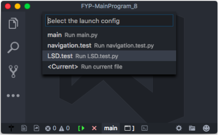
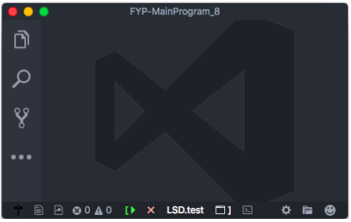

# Statusbar Debugger

Allows user directly start/stop the debugging, and select debug configuration via statusbar.

## Screenshot





## Usage

* configure setting `statusbar_debugger.positionPriority`, `statusbar_debugger.clearConsoleBeforeDebug` , `statusbar_debugger.defaultConfig` and `statusbar_debugger.optionList`

## Settings

* `statusbar_debugger.positionPriority`
	* The priority of the last StatusBarItem. Higher value means the item should be shown more to the left.

* `statusbar_debugger.clearConsoleBeforeDebug`
	* If true, clear the REPL or integrated terminal before debugging.


* `statusbar_debugger.defaultConfig`
	* the default launch config
    * any launch config attributes are allowed for every item in the array (see [launchjson-attributes](https://code.visualstudio.com/docs/editor/debugging#_launchjson-attributes))
		
		* any launch config attributes ...
    * example
```
{
	"type": "python",
	"request": "launch",
	"stopOnEntry": false,
	"pythonPath": "${config.python.pythonPath}",
	"console": "integratedTerminal",
	"debugOptions": [
		"WaitOnAbnormalExit",
		"WaitOnNormalExit",
		"RedirectOutput"
	]
}
```

* `statusbar_debugger.optionList`
	* array of debug options
    * these properties are allowed for every item in the array
		* `selected`: If true, it become the defulat selected option.
        * `displayName`: The text shown in the statusbar.
        * `config`
			* launch config objcet"
    		* any launch config attributes are allowed for every item in the array (see [launchjson-attributes](https://code.visualstudio.com/docs/editor/debugging#_launchjson-attributes))
				* `name`: The name of debug config. Would shown in the Quick Pick description.
				* any other launch config attributes ...
        
    * example
```
[{
	"displayName": "main",
	"config": {
		"name": "Run main.py",
		"program": "${workspaceRoot}/src/main.py"
	}
},
{
	"displayName": "navigation.test",
	"config": {
		"name": "Run navigation.test.py",
		"program": "${workspaceRoot}/test/navigation.test.py"
	}
},
{
	"selected": true,
	"displayName": "<Current>",
	"config": {
		"name": "Run current file",
		"program": "${file}"
	}
}]
```


## Changelog

* v1.0.0
    * initial release

